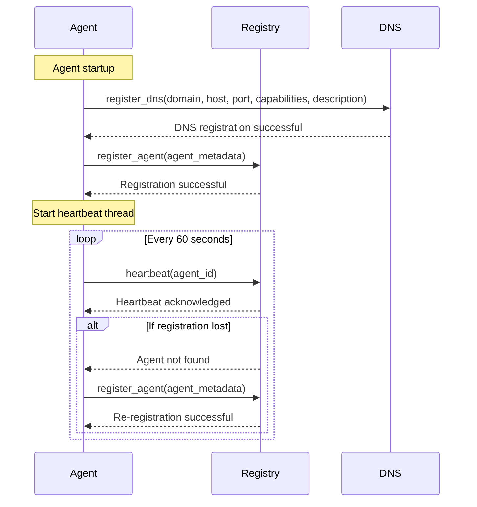
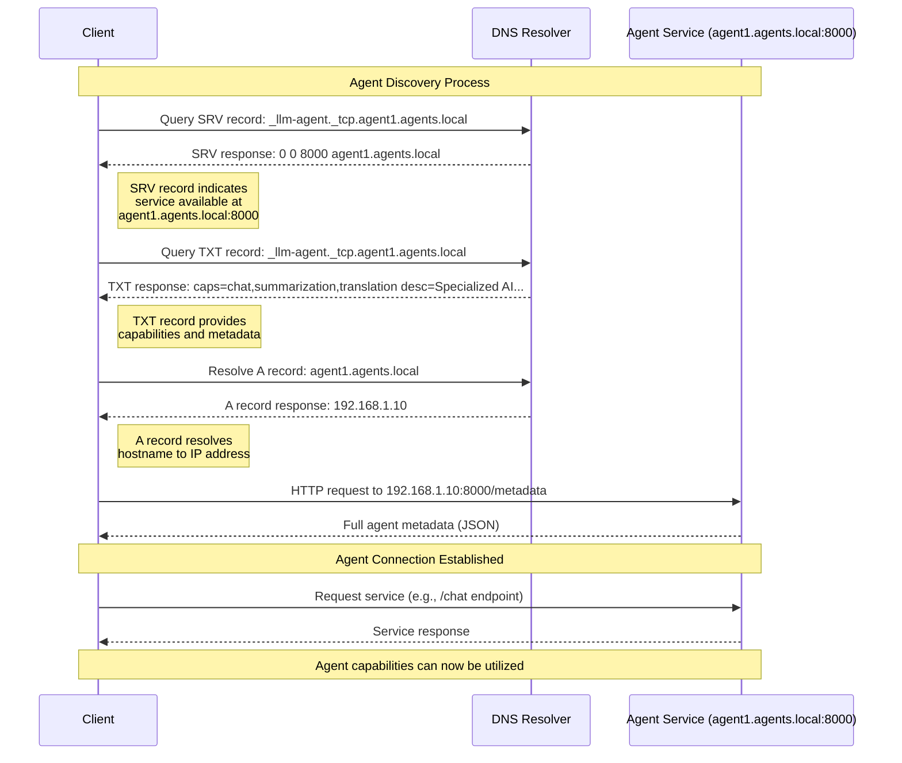
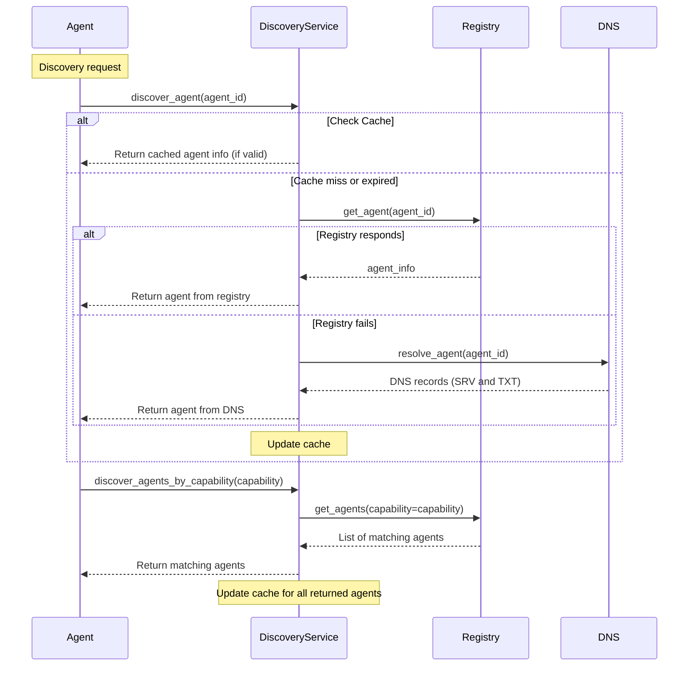
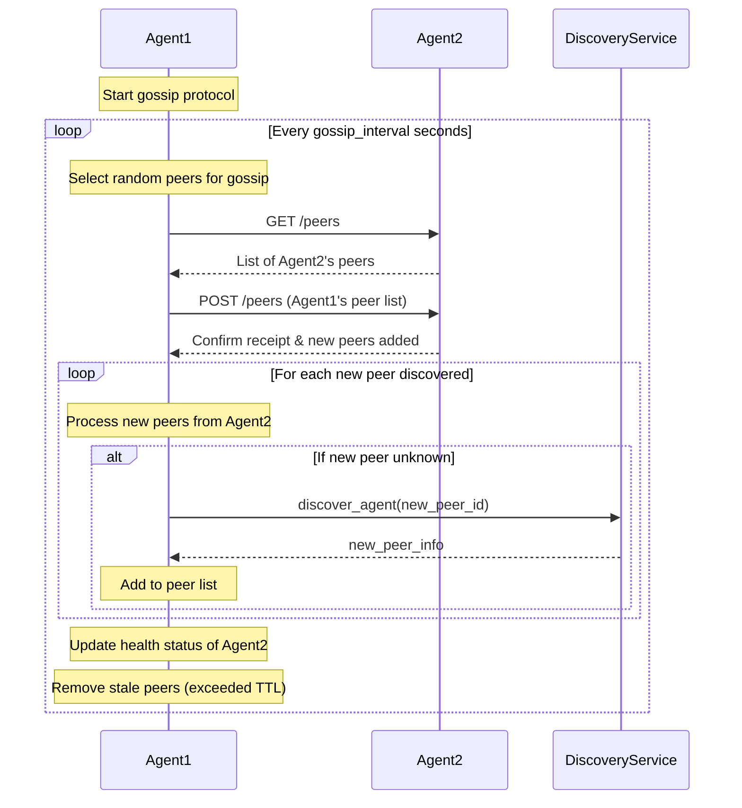
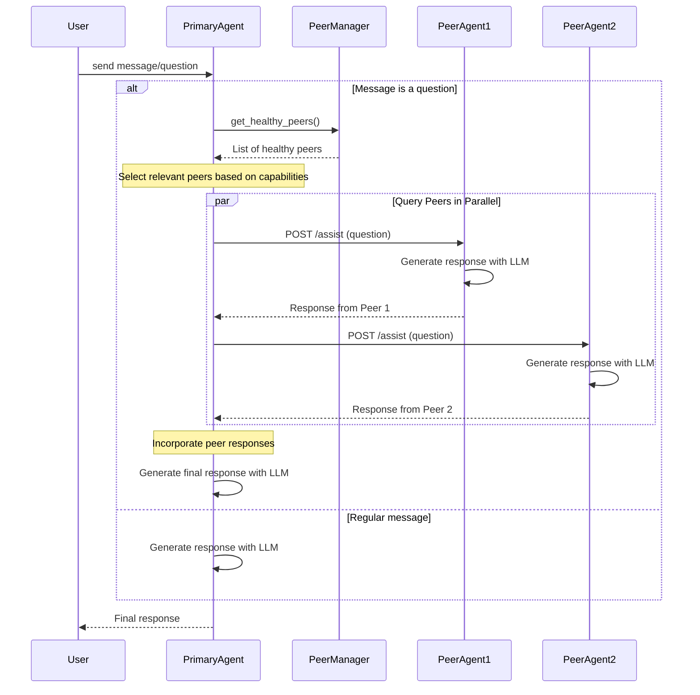
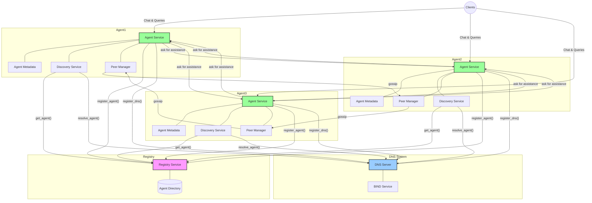

# The Agent Communication and Discovery Protocol Specification

*[This document was created with the assistance of Anthropic's Claude LLMs.]*
*[This document is in draft]*

**Overview:** This specification defines an Agent Communication and Discovery Protocol that allows Large Language Model (LLM) agents to advertise themselves via DNS and discover peers in a hybrid decentralized manner. It supports any type of LLM-based agent, leveraging standard DNS records (TXT, SRV) for discovery and metadata, augmented by a central registry for dynamic updates and search. All agent-to-agent and agent-to-registry communication uses HTTPS for security and interoperability. The protocol defines how agents register their endpoints, discover each other (both through DNS and peer-to-peer awareness), describe their capabilities in a structured way, and establish secure communications. The following sections outline the core aspects of the protocol: Discovery Mechanism, Peer Awareness, Metadata Schema, Security Considerations, and Communication Protocol implementation guidelines.

## Discovery Mechanism

**Registration via DNS:** Each LLM agent is identified by a DNS domain name and uses DNS records to advertise its service endpoint. The agent’s administrator (or the agent itself, if authorized) publishes a DNS SRV record in the agent’s domain, specifying the host and port where the agent’s API can be reached. The SRV record follows the format `_<service>._<proto>.<domain> IN SRV <priority> <weight> <port> <target>`. For this protocol, a service label like _llm-agent (or_agent) and protocol _tcp (since communication is over HTTPS TCP port) are used. For example:

```text
_llm-agent._tcp.example.com. 3600 IN SRV 0 0 443 agent0.example.com.
```

This indicates the agent service is accessible via HTTPS on port 443 at host agent0.example.com (which in turn has an A/AAAA record for its IP). The SRV fields priority and weight can be used for load balancing or backup endpoints if an agent has multiple instances.

DNS Metadata (TXT Records): Alongside the SRV, a DNS TXT record for the same service label contains key–value metadata about the agent. TXT records allow attaching arbitrary text information to a domain. This specification adopts a DNS-SD style key/value syntax for structured data. For example, the TXT record may include fields like:

```text
_llm-agent._tcp.agent0.example.com. 300 IN TXT "ver=1.0" "caps=chat,summarization,translation" "desc=Specialized AI assistant for security investigation"
```

In this example:

- **ver** is the agent protocol version,
- **desc** is a short description,
- **caps** enumerates capability codes (e.g. “chat”, “summarize”), and optionally,
- **api** might indicate a base URL path for agent API endpoints.

Using TXT records in this way leverages existing DNS infrastructure to publish agent attributes. (Note: DNS TXT data has size limits ~255 chars per string, but multiple strings can be used. Large metadata beyond this scope will be provided via the agent’s HTTP interface as described later.)

**Central Registry:** In addition to DNS, agents register with a central registry service to facilitate discovery and timely updates. The central registry maintains a directory of active agents and their metadata, acting as a well-known lookup service. An agent registers by sending an HTTPS registration request to the central registry’s API (for example, `POST /registerAgent`). The request includes the agent’s domain name, network details (host, port), and its capability metadata (usually the same data as in the DNS TXT record, possibly in JSON format). Upon successful registration, the central registry can (a) store the agent’s info in its database, and (b) optionally publish or update a DNS entry in a global “agents” zone. For instance, the registry might be authoritative for a domain like agents.example.net and create a DNS pointer for the new agent (such as a PTR record in a service directory). This hybrid approach ensures that even if direct DNS publishing is not feasible for an agent (e.g. no custom domain), the central registry can list it.

**The Registration process would look something like this:**



```bash
09-Apr-2025 12:27:39.238 client @0xffff640036b0 127.0.0.1#40573: updating zone 'agents.local/IN': adding an RR at '_llm-agent._tcp.agent3.agents.local' SRV 0 0 8000 agent3.
09-Apr-2025 12:27:39.238 client @0xffff640036b0 127.0.0.1#40573: updating zone 'agents.local/IN': adding an RR at '_llm-agent._tcp.agent3.agents.local' TXT "ver=1.0" "caps=security,threat_detection,attack_patterns,response,log_analysis" "desc=AI assistant specializing in security analysis and threat detection"
2025-04-09 07:27:39 INFO:__main__:DNS update result: DNS records updated successfully for agent3.agents.local
```

**Record Formats and Updates:** The agent’s DNS records should be structured as described, and whenever the agent’s endpoint or capabilities change, the records must be updated. This can be done through dynamic DNS updates (if the agent controls its DNS zone) or by updating the central registry which in turn updates the DNS entry. For example, if an agent’s IP or host changes, the SRV target and possibly the domain’s A/AAAA record need updating. If the agent gains new capabilities, the TXT record and registry entry should be revised. The central registry exposes an HTTPS update endpoint (e.g. `PUT /agents/<id>`) where agents can send changes to their metadata or status. The registry may also push these updates to a public DNS-SD (Service Discovery) zone or an internal cache accessible to clients. Each registration and update operation is authenticated (see Security section) to ensure only legitimate agents/owners can modify their entry.

**Discovery via DNS:** Clients or peer agents can discover an agent by querying DNS. If the agent’s domain is known, a DNS SRV lookup on `_llm-agent._tcp.<domain>` will return the service details (host and port), and the associated TXT gives immediate info about capabilities. If the agent’s domain is not known, a client can query the central registry (via an API or possibly via a special DNS query to the registry’s zone) to search for agents. The registry can implement a DNS-based index: for example, a DNS PTR record for a capability type. In DNS-SD, a PTR is often used to list all instances of a service. By analogy, the registry’s DNS zone could have records like `_chat._udp.agents.example.net` PTR exampleagent.com to map a capability or category to agent domains. However, because the number of agents may be large, an HTTPS query interface for the registry is more flexible for searches (allowing queries like “find all agents with capability X” or full-text search on descriptions).

### Agent Discovery via DNS



**Discovery via Central Registry:** The central registry functions as a searchable directory. It should provide endpoints such as `GET /agents` (to list all or by filter) and `GET /agents?capability=<cap>` to find agents that support a given capability. It may also provide a web interface or feed of new agents. Agents are encouraged to register to improve discoverability, but the system still prioritizes using standard DNS where possible to avoid centralization. In practice, the registry complements DNS: DNS is fast and decentralized (with caching, replication, etc.), while the registry provides a convenient, up-to-date index and API for queries.

### Agent Discovery via Registry



**Dynamic Updates:** The hybrid approach ensures changes propagate reliably. Agents periodically send heartbeats or update messages to the central registry to confirm they are alive and to refresh their registration (for example, an agent might `PUT /agents/<id>/heartbeat` every few minutes). If an agent fails to heartbeat within a certain interval, the registry can mark it as offline (and could update a DNS entry such as removing its PTR or adding a status flag in TXT). This reduces stale entries. Meanwhile, DNS TTLs for the SRV/TXT records should be kept moderately low (e.g. 5 minutes) to allow DNS changes to be noticed relatively quickly by resolvers. Administrators managing the DNS zones should enable DNSSEC to sign the agent records, so that other parties can verify the DNS data’s authenticity (preventing attackers from spoofing records).

## Peer Awareness

**Decentralized Peer Discovery:** In addition to DNS and the central registry, agents engage in peer-to-peer awareness to form a decentralized network. Once an agent is online and registered, it can discover other “peer” agents without always querying the central registry. This is achieved through a gossip-like protocol and mutual notifications among agents. The process works as follows:

**Initial Peer List:** When an agent starts up, it bootstraps its peer list. It first queries the central registry for a starter list of known active agents (e.g., the registry might return a handful of random agent addresses or those in similar categories). Additionally, the agent might have some pre-configured well-known peers or cache from a previous run. The agent can also perform a DNS-SD query on a known domain (if a global agents directory domain is used) to get a list of some agent service records.

**Peer-to-Peer Introduction:** The agent then attempts to connect to one or more peers from this initial list. When two agents connect (over HTTPS), they exchange introductions. Each agent shares a subset of its known peer list with the other. For example, Agent A sends Agent B a list of N other agents it knows (their domain or endpoint addresses), and vice versa. This gossip exchange means that even if Agent A and Agent B learned about different sets of peers from the registry or prior contacts, they will propagate those lists to each other. Over time and multiple interactions, this causes knowledge of agents to diffuse through the network.

**Gossip Protocol:** The protocol for peer exchange can be similar to a gossip protocol. Each agent periodically selects a few random known peers and connects to them (or uses an existing connection) to sync lists. They might send a message like “Give me any new peers you’ve learned about, and here are some new ones I learned” (ensuring not to resend ones the peer already knows). This can be done with a simple HTTP GET/POST: for example, GET /peers could return a JSON list of known peer identifiers (domains), and a POST /peers could accept a list of new peers to add. In practice, a single request can both send and receive peer info (the response to a GET could include the remote peer’s list, or an endpoint can be defined specifically for peer exchange transactions).

### Peer Gossip Communication



**Log data would look similar to:**

```bash
agent2-1  | 2025-03-13 03:04:37,730 - peers.peer_manager - DEBUG - Getting peers from agent1.agents.local at http://agent1:8000/peers
agent2-1  | 2025-03-13 03:04:37,732 - peers.peer_manager - DEBUG - Received 2 peers from agent1.agents.local
agent2-1  | 2025-03-13 03:04:37,732 - peers.peer_manager - DEBUG - Retrieved peer info for agent0.agents.local: {
agent2-1  |   "capabilities": [
agent2-1  |     "chat",
agent2-1  |     "summarization",
agent2-1  |     "translation"
agent2-1  |   ],
agent2-1  |   "description": "Specialized AI assistant for security investigation",
agent2-1  |   "endpoints": {
agent2-1  |     "metadata": "/metadata",
agent2-1  |     "peers": "/peers",
agent2-1  |     "ping": "/health",
agent2-1  |     "task": "/chat"
agent2-1  |   },
agent2-1  |   "id": "agent0.agents.local",
agent2-1  |   "interfaces": {
agent2-1  |     "rest": "http://agent0:8000/v1"
agent2-1  |   },
agent2-1  |   "last_update": 1741835013.5496686,
agent2-1  |   "model_info": {
agent2-1  |     "provider": "Anthropic",
agent2-1  |     "type": "Claude-3-Sonnet"
agent2-1  |   },
agent2-1  |   "name": "Agent Zero",
agent2-1  |   "owner": "Commnand Zero",
agent2-1  |   "protocols": [
agent2-1  |     "rest-json"
agent2-1  |   ],
agent2-1  |   "version": "0.1.0",
agent2-1  |   "_source": "registry",
agent2-1  |   "_cache_time": 1741835077.7253497
agent2-1  | }
agent2-1  | 2025-03-13 03:04:37,732 - peers.peer_manager - DEBUG - Exchanging peers with agent0.agents.local
agent2-1  | 2025-03-13 03:04:37,732 - peers.peer_manager - DEBUG - Found peers endpoint in peer info: /peers
agent2-1  | 2025-03-13 03:04:37,733 - peers.peer_manager - DEBUG - Peer rest interface: http://agent0:8000/v1
agent2-1  | 2025-03-13 03:04:37,733 - peers.peer_manager - DEBUG - Extracted host: agent0, port: 8000 from REST interface
agent2-1  | 2025-03-13 03:04:37,733 - peers.peer_manager - DEBUG - Validating URL: /peers (defaults: host=agent0, port=8000, path=/peers, use_https=False)
agent2-1  | 2025-03-13 03:04:37,734 - peers.peer_manager - DEBUG - Reconstructed URL: http://agent0:8000/peers
agent2-1  | 2025-03-13 03:04:37,734 - peers.peer_manager - DEBUG - Validated peers endpoint: http://agent0:8000/peers
agent2-1  | 2025-03-13 03:04:37,734 - peers.peer_manager - DEBUG - Sending 2 peers to agent0.agents.local at http://agent0:8000/peers
agent2-1  | 2025-03-13 03:04:37,736 - peers.peer_manager - DEBUG - Getting peers from agent0.agents.local at http://agent0:8000/peers
agent2-1  | 2025-03-13 03:04:37,738 - peers.peer_manager - DEBUG - Received 2 peers from agent0.agents.local
agent2-1  | 2025-03-13 03:04:37,738 - peers.peer_manager - INFO - Gossip round completed: {'status': 'completed', 'gossip_peers': ['agent1.agents.local', 'agent0.agents.local'], 'results': {'agent1.agents.local': {'status': 'success', 'sent_peers': 2, 'received_peers': 2, 'new_peers': []}, 'agent0.agents.local': {'status': 'success', 'sent_peers': 2, 'received_peers': 2, 'new_peers': []}}, 'stale_peers_removed': []}
```

**Maintaining Peer Lists:** Each agent maintains an internal list/database of peer agents. Entries include the peer’s domain or identifier, last seen timestamp, and maybe a cache of its capabilities (fetched from metadata). The list is continually updated as new peers are discovered. To prevent unbounded growth, agents may cap the list size (preferring most recently seen or most relevant peers) or age out peers that have not responded in a long time. A time-to-live (TTL) can be associated with peer entries – if an agent hasn’t heard about or from a peer for, say, an hour or a day, it will attempt to reconfirm that peer’s availability (e.g. by an HTTPS ping or DNS lookup) and if unsuccessful, remove it.

**Decentralized Update Propagation:** When a new agent comes online and registers (or when an existing agent updates its info), this news propagates in two ways: (1) via the central registry (which others might poll periodically), and (2) via peers telling peers. For example, if Agent X is new and registers with the central registry, the registry might notify a few subscribed peers or simply when another agent asks the registry it will learn of X. Separately, if Agent X connects to some initial peers, those peers will learn of X and can forward that info to others in subsequent gossip rounds. In this way, even if the central registry is offline or an agent joined through only a single peer, the knowledge of that agent can spread through the network.

**Local Domain Discovery:** In cases where multiple agents reside in the same local network or domain, multicast DNS (mDNS) could optionally be used for local peer discovery. While the primary design is for global DNS, agents on a LAN could broadcast a presence (using `_llm-agent._tcp.local` for example) so that they auto-discover each other without central coordination. This is an optional extension for intranet or IoT environments and falls back to the same metadata schema (just discovered via mDNS).

**Central Fallback:** The peer-to-peer list is decentralized, but to maintain consistency, the central registry can serve as a fallback source of truth. Agents might periodically reconcile with the central registry’s data – for instance, once an hour an agent could fetch the registry’s current list of active agents and merge it with its peer list (adding any it missed, and possibly informing the registry of any it knows that the registry might not, though in a well-managed system the registry should know all public agents). This ensures that isolated clusters of peers eventually connect through the registry.

**Scaling:** In a large network, each agent doesn’t need to know every other agent. The peer awareness mechanism can be tuned. For example, agents might focus on discovering peers that share similar capabilities or purpose. The central registry could provide filtered peer lists (like “give me peers that handle image analysis if that’s what I do”). Gossip exchanges could also include only peers of potential interest. This prevents thousands of irrelevant agents from flooding each other. The protocol does not assume a fully complete peer graph; it simply provides a means for an agent to find enough peers to collaborate or route requests.

**Failure and Refresh:** If a peer becomes unresponsive or is shut down, other agents will detect this (e.g., their periodic peer ping fails or an HTTPS request times out). They should then mark that peer as inactive. They might inform some other peers that “peer X seems down” in the next gossip cycle, or simply stop reporting X so it naturally ages out of others’ lists. An agent coming back online after downtime would re-register (updating timestamp) and then be redistributed as new.

Peer awareness is maintained by each agent collectively sharing knowledge of others, rather than relying solely on a central list. This decentralized approach improves resilience: even if the central registry is unreachable, agents can still discover newcomers and recognize which peers are active by communicating amongst themselves.

## Metadata Schema

Each agent exposes a structured metadata description of its identity and capabilities. This metadata is used in DNS TXT records (in condensed form) and exchanged in full via HTTPS. The schema is designed to be extensible yet standardized, using a JSON format for flexibility. The metadata provides enough information for other agents or clients to understand what the agent can do and how to interact with it. Below is the core schema and field definitions:

- **id (string):** A unique identifier for the agent. This is often the agent’s primary domain name (e.g., "exampleagent.com") or a globally unique name. It could also be a URN or UUID, but using the DNS domain as an ID is convenient and human-readable.

- **name (string):** A human-friendly name for the agent. This might be a short title, e.g., "ExampleAgent". If not provided, the id or domain can serve as name.

- **description (string):** A brief description of the agent’s purpose and functionality. For example, "A GPT-4 powered agent that answers questions and summarizes text." This helps humans and other agents quickly understand its role.

- **capabilities (array of strings):** A list of capability identifiers that the agent supports. Capabilities are typically expressed as keywords or codes. Examples: ["chatbot", "summarization", "translation"] or ["image-analysis", "planning"]. There isn’t a fixed enum in this spec (it can be extended), but common tasks should use standardized names when possible so that agents can search/filter by them. The DNS TXT caps field is a compressed form of this (often a comma-separated string).

- **interfaces (object):** Details of the communication interfaces the agent supports. This typically includes at least an HTTPS REST interface. For example:

- **interfaces.rest** – base URL or path for REST API (e.g., "<https://api.exampleagent.com/v1>" or just "/v1" if the domain is known from DNS SRV).

- Optionally, other interfaces can be listed, like interfaces.grpc or interfaces.websocket if the agent supports gRPC or streaming via WebSocket on certain endpoints. Each interface entry would include necessary connection info (host, port if non-standard, protocol version, etc.). In most cases, the SRV record already gives host/port for HTTPS, so the metadata mainly adds path or protocol specifics.

- **protocols (array of strings):** The communication protocols or standards the agent speaks for higher-level interactions. Since HTTPS is mandatory for transport, this refers to things like message schemas or agent interaction protocols. For instance, an agent might support an agent specific message format) or simply "rest-json" for a basic RESTful JSON API. This helps ensure compatibility – two agents can find if they have a common language or protocol for task execution.

- **version (string):** The version of the agent’s software or model (not to be confused with the protocol version). For example, "1.2.0" or a date or commit hash. This can be useful for debugging or for other agents to know if they are interacting with a specific version (perhaps important if capabilities change between versions).

- **model_info (object):** Information about the underlying LLM model(s) the agent uses. Possible subfields: model_info.type (e.g., "Sonnet-3.5"), model_info.provider (e.g., "Anthropic"), model_info.language (if it’s a language-specific model), etc. This is optional but gives insight into the agent’s AI engine.

- **owner (string):** The name or identifier of the entity that runs the agent. This could be a company, organization, or individual’s name or a contact email. (If privacy is a concern, this can be omitted or a generic identifier used.)

- **trust (object):** This section contains any public keys or certificates used to verify the agent’s identity and signed data. For example, trust.public_key might hold the agent’s public key (if it signs its responses or metadata), or trust.certificate could hold a certificate chain (though typically the HTTPS TLS certificate is used for identity, having a separate key here could serve for message signing or out-of-band verification). The central registry can store this to verify updates. Including it in metadata helps agents doing peer-to-peer trust establishment.

- **endpoints (object):** Specific URLs for common actions in the agent’s API. While interfaces.rest gives a base URL, endpoints can list well-known paths such as:

- **endpoints.metadata** – URL to fetch this metadata (e.g., <https://exampleagent.com/.well-known/agent-metadata> or simply the same JSON delivered via a certain route).

- **endpoints.peers** – URL to get the peer list (GET /peers as mentioned).

- **endpoints.ping** – a health-check or heartbeat endpoint (e.g., GET /health returning simple status).

- **endpoints.task** – an endpoint to send a task or message to the agent (could be something like POST /chat for a chatbot, or a more general /invoke).

These are optional but recommended conventions. Including them lets other agents programmatically know how to interact (for example, an agent can automatically retrieve another’s peers by looking at endpoints.peers).

- last_update (string or timestamp): ISO 8601 or Epoch timestamp of when the metadata was last updated. This can help caching and consistency. Agents and registries may use it to check if they have the latest info or if they should refresh.

This schema can be serialized as a JSON object. For example:

```json
{
  "id": "exampleagent.com",
  "name": "ExampleAgent",
  "description": "A LLM powered agent that answers questions and summarizes text.",
  "capabilities": ["chatbot", "summarization", "translation"],
  "interfaces": {
    "rest": "https://api.exampleagent.com/v1"
  },
  "protocols": ["rest-json"],
  "version": "0.1.0",
  "_source": "registry",
  "model_info": { "type": "Sonnet-3.7", "provider": "anthropic" },
  "owner": "ExampleCorp AI Division",
  "trust": {
    "public_key": "MIIBIjANBgkqh... (base64 RSA key)",
    "certificate": "-----BEGIN CERTIFICATE-----...-----END CERTIFICATE-----"
  },
  "endpoints": {
    "metadata": "/v1/metadata",
    "peers": "/v1/peers",
    "ping": "/v1/health",
    "task": "/v1/chat"
  },
  "last_update": 1741835013.5496686,
  "_cache_time": 1741835077.7253497
}
```

The metadata exchange format is primarily JSON over HTTPS. However, a compact subset of fields is also present in DNS TXT for quick discovery (for instance, desc and caps as shown earlier, plus perhaps a version). The central registry stores the full JSON for each agent. Agents themselves should serve this JSON (at the well-known path or via their API) so that peers can retrieve the latest capabilities directly from the source. This is especially useful if DNS TXT only contains minimal info due to size limits – the TXT can include a URL or path to fetch the full metadata if needed.

**Schema Extensibility:** The schema is designed to be forward-compatible. Agents and registries should ignore fields they don’t recognize, to allow adding new fields in the future. For instance, if a new field roles or rating is added later, older agents would skip it. We use simple keys for TXT records due to length constraints, but in JSON they can be more descriptive.

**Structured Capabilities:** To facilitate automated reasoning about capabilities, a standardized vocabulary is encouraged. The community of LLM agents can maintain a list of common capability keywords. For example, caps=chat could mean the agent can carry out conversational chat, caps=plan might mean it can do autonomous planning, etc. The metadata could also include a more detailed breakdown of each capability (e.g., an object with name, description, maybe performance metrics), but to keep the core schema lean, we stick to listing them by name. If needed, an agent could host a more detailed profile or an OpenAPI specification of its endpoints for clients to understand exactly how to invoke those capabilities.

In summary, the metadata schema provides a common language for agents to advertise what they can do, in a machine-readable form. It aligns with DNS records (for basic info) and expands via JSON over HTTP for rich detail. This structured description is key for interoperability: it lets a requesting agent decide which peer is suitable for a task, and how to call it.

## Communication Protocol

All interactions in the agent network use HTTPS as the transport protocol, ensuring compatibility with web standards and ease of use through firewalls/proxies. The communication protocol defines how agents talk to the central registry and to each other to exchange the discovery information (and by extension, how they might invoke capabilities, though task invocation specifics can vary). Key elements include the use of RESTful APIs, standard methods (GET, POST, etc.), and structured data (JSON) for requests and responses.

Agents and the registry must have HTTP servers to receive requests, and HTTP clients to make requests to others. By using HTTPS, we ensure encryption and identity verification via TLS. The default port is 443 (as indicated in SRV records), but agents could advertise a different port if needed.

**Central Registry API:** The central registry provides endpoints for registration and discovery:

- `POST /registerAgent`– Agents call this to register themselves. The payload is a JSON matching the metadata schema (or a subset) and includes an authentication token or signature. The registry responds with a success acknowledgment, possibly including an assigned agent ID or confirmation of the record. This could also be used for updating if the same endpoint is used, or there could be a separate `PUT /agents/<id>` for updates.

- `GET /agents` – Returns a list of registered agents (could be just IDs and maybe brief info). This might support pagination if there are many agents.

- `GET /agents/<id>` – Returns the detailed metadata for a specific agent (by ID or domain). For privacy, some fields like owner contact might be included here only if the owner allows.

- `GET /agents?capability=X` – A query interface to search for agents by capability or other criteria. The response is a list of agents (or perhaps their IDs/addresses) that match, possibly with a snippet of their description.

- `GET /agents/changes?since=<time>` – (Optional) Allows agents to ask for a list of new or updated agents since a given timestamp. This can be useful for agents that want to periodically poll the registry for changes rather than retrieving the whole list each time. The registry can return a delta (like agent IDs that are new or removed).

- `DELETE /agents/<id>` – (Optional) Allows an agent (with proper auth) to unregister itself, e.g., if it’s shutting down permanently or wants to temporarily hide. The registry would then remove or mark it offline (and could propagate that to DNS or other agents).

All registry responses are JSON. For example, `GET /agents` might return:

```json
{
  "agents": [
     {"id": "exampleagent.com", "name": "ExampleAgent", "capabilities": ["chatbot","summarization"]},
     {"id": "picture-bot.ai", "name": "VisionBot", "capabilities": ["image-analysis"]}
  ]
}
```

as a summary list (with full detail available via each agent’s metadata or a detail endpoint).

**Agent-to-Agent Communication:** Once an agent has discovered another’s address (via DNS or registry or peer gossip), it will interact directly with that agent over HTTPS. Two main categories of agent-agent communication are: discovery exchange (metadata, peer lists) and task requests (utilizing the agent’s capabilities). The protocol focuses on the discovery aspect, but we outline both for completeness:

**Metadata Exchange:** An agent can retrieve another agent’s metadata by performing a GET on the metadata URL. As defined in the metadata schema, each agent should host its metadata at a known path. This could be a well-known URI such as `https://<domain>/.well-known/llm-agent.json` or a path advertised in DNS TXT (as api or in the SRV target). Alternatively, a convention like `GET /metadata` or `GET /capabilities` on the agent’s base URL can be used. The agent returns the JSON metadata (same structure as above). This allows the querying agent to verify capabilities, check the trust info, etc., directly from the source. Because this is over HTTPS, the response authenticity is as good as the TLS connection (which is why verifying the certificate is important). The metadata may also include the agent’s public key, which can be used to verify a digital signature if the agent signs any messages.

**Peer List Exchange:** For peer awareness, as described, an agent can use `GET /peers` on another agent to ask for its known peers. The response would be a JSON list of peer identifiers (likely domain names or IDs). For example:

```json
{ "peers": ["alpha-agent.com", "beta-agent.net", "..."] }
```

Optionally, the agent might also return some info about those peers (like a couple of their capabilities or last-seen times) if it wants, but just the identifiers is sufficient for discovery. There could also be a `POST /peers` to submit new peer info. However, it might be more efficient that when Agent A requests `GET /peers` from B, it includes some of A’s own peer info in the request. HTTP GET doesn’t have a body, so this could be done by A following up with a `POST /peers` to B to send a list that B might not have. Another design is a single bidirectional exchange endpoint, but since HTTP is request-response, it’s easier to just do two calls (one each way) or piggyback in headers. Implementation can vary; the simplest is: A does `GET /peers` from B to learn B’s list, and then A optionally does `POST /peers` to B with any new peers A knows that B’s list didn’t mention. This ensures both end up roughly with the union of lists.

**Health Checks:** Agents might call each other’s health or ping endpoint (`GET /health` or as given by endpoints.ping). This returns a simple status (200 OK with maybe a JSON {status:"ok"} or similar). This is useful before assuming a peer is alive or before sending a task request. The central registry may also call these periodically – an agent could register a health endpoint with the registry, and the registry will hit it periodically to update the agent’s status.

**Task Invocation:** If one agent wants to utilize another’s capabilities (for example, ask a question, have it summarize text, etc.), it will use a defined API endpoint on the peer. This is beyond pure discovery, but to illustrate: the metadata’s capabilities and endpoints tell what it can do and where. E.g., if capabilities includes “summarization” and the endpoints.task is /v1/summarize, then Agent A might do a `POST /v1/summarize` on Agent B, sending the content to summarize in the request body. The exact formats for tasks would depend on the capability and could be standardized separately (for instance, a JSON with prompt or data). The response would be the result of that task. The communication protocol ensures these requests are over HTTPS and possibly authenticated/authorized if required (for instance, an agent might only accept tasks from certain trusted peers or if a valid token is provided).

**Response Formats:** For all the above interactions, JSON is the preferred format for responses (and requests when applicable). It’s human-readable and widely supported. If an agent needed to send binary data (not typical for text-based LLM tasks, but maybe for an image analysis agent sending an image), it could use Base64 in JSON or use a separate endpoint/URL (with proper content-type). However, discovery and metadata are textual JSON.

**Error Handling:** HTTP status codes are used to indicate errors. For example, if an agent requests `/peers` on another agent that doesn’t support peer exchange, it might return 404 or 501 Not Implemented. If an unauthorized request is made to a protected endpoint, 401 or 403 would be returned. Agents should handle timeouts or unreachable hosts gracefully (mark peer as down after repeated failures, etc.). The specification encourages use of standard HTTP semantics so that existing tools and libraries can handle a lot of this (redirects, retries, etc., if applicable).

Example Interaction Workflow:

1. Agent Registration: Agent X (domain example.ai) makes `POST /registerAgent` to registry with its metadata. Registry verifies and adds it. The registry may in turn update DNS: e.g., add _llm-agent._tcp.example.ai SRV... to X’s DNS zone if it has control or at least store the data for queries.

2. Agent Y Discovers X: Agent Y queries the registry or its peers for new agents. Suppose Y gets the info that X exists (either from `GET /agents?capability=something` or a peer told it about x.ai). Y now does DNS lookup _llm-agent._tcp.example.ai → gets target host and port, plus TXT with caps. Y connects via HTTPS to <https://example.ai> (or the target host) on port 443.

3. Handshake: (Optional but recommended) Y might call `GET /metadata` on X to fetch full details and confirm X’s identity (checking the certificate, reading the trust.public_key etc.). X returns its metadata JSON. Y validates and stores X in its peer list with capabilities.

4. Peer Exchange: Y then calls `GET /peers` on X to see who X knows. X returns a list, which might include some agents Y hasn’t seen. Y merges those into its knowledge base. Y might also do a `POST /peers` to X sharing any of Y’s known peers that X didn’t list, helping X expand its view.

5. Task Request: Now that Y trusts X and knows X can, say, do summarization, Y sends `POST /v1/summarize` to X with a JSON body like`{"text": "Long text...", "summary_length": 100}`. X processes and responds with `{"summary": "Short summary..."}`. This is outside the discovery per se, but it’s the end goal of having discovered a capable peer.

6. Ongoing: X and Y might keep each other in a heartbeat loop – e.g., Y calls X’s `/health` every few minutes, or they rely on gossip from others to know if one goes down. If X goes offline, it will stop heartbeating to registry, which after a timeout will mark X as inactive; peers of X will also timeout on health checks to X and remove it from lists.



**Communication Standards:** The protocol does not invent a new transport or encoding – it sticks to HTTPS+JSON as these are widely supported. This means any existing HTTP client library can be used by the agents (which are essentially specialized web clients/servers). It also means messages can traverse proxies and standard internet infrastructure easily. Agents should also gracefully handle network issues (use timeouts, exponential backoff when retrying calls to a peer or registry, etc., to avoid network congestion or storms in failure cases).

**Structured Metadata Exchange:** When exchanging metadata or peer lists, agents should use the exact formats defined so that the receiving side can parse it. For instance, when an agent returns Content-Type: application/json with the metadata, the fields should correspond to the schema keys (id, name, capabilities, etc.). If an agent or client uses a different format, it breaks interoperability. Thus, adherence to the schema and protocol is crucial. The use of existing standards (DNS, HTTPS, JSON, REST) is intended to maximize interoperability and minimize the need for custom networking code.

**Extensibility and Future Protocols:** While HTTPS/REST is the baseline, the protocol could be extended to support other interaction patterns. For example, agents might eventually use a message queue or pub/sub for discovery or notifications of new agents. This spec does not cover that, but the design doesn’t preclude it – for instance, an agent could list a broker address in its metadata for receiving announcements. Another extension could be to enable WebSocket connections between agents for real-time collaboration (one agent streaming data to another). Those would be built on top of the HTTPS channel (since WebSocket can be negotiated over HTTPS (wss://) as well). The primary requirement would be that any alternative communication still ensures authentication and encryption.

Finally, all interactions, especially those with the central registry, should be logged (with proper privacy). Logging helps auditing of the discovery process (e.g., you can trace which agent introduced a malicious one if needed, or how an agent was discovered). But logs should not store sensitive content of tasks, focusing on discovery events.

**A simple architecture would look similar to this:**



## Model Context Protocol (MCP) for Structured Tool Access and Discovery

Anthropic’s **Model Context Protocol (MCP)** is an open standard that standardizes how application context is provided to LLM-based agents. It follows a client–server model: AI applications act as **MCP clients/hosts**, connecting to **MCP servers** that expose data or functions, enabling secure two-way integration between models and external systems.

By incorporating MCP into the Agent Communication and Discovery Protocol, agents gain a standardized way to discover and use external tools and data sources. An **MCP Server** essentially acts as a **structured “tool provider”** that an agent can register as part of its toolbox. Rather than hard-coding integrations, the agent can dynamically connect to an MCP server and query its capabilities.

Overall, adding MCP integration means the Agent Communication and Discovery Protocol can handle **tool discovery and context retrieval in a structured, standardized fashion**. Agents become more modular – they can plug into any MCP-compatible service and immediately know *what* it can do (via listed tools/prompts) and *what data* it offers (via resources), without bespoke implementations. This fosters an ecosystem where new capabilities can be “discovered” and used by agents on the fly, accelerating development and ensuring compatibility.

By incorporating DNS and registry-based discovery, the agent can **autonomously locate tools** it can use, rather than only using a fixed list. In practice, an agent might first check the central registry for any known MCP servers (e.g. ones the user or organization has approved), and also perform DNS queries in relevant domains to find additional local servers. This update makes the agent more flexible and network-aware, the agent can now find AI tool endpoints by name. This discovery process should be confined to trusted sources (e.g. an enterprise’s internal DNS or registry, or a vetted public registry) to prevent unauthorized or malicious endpoints from being used.

**MCP-enhanced agent communication** provides contextual abilities for agents, and ensures that everything is structured, controlled, and auditable. Enterprises can accelerate AI integration projects since they no longer need to custom-build connectors for each system – a new MCP server or an existing one from the open-source community can be plugged in, and the Agentic protocol takes it from there. Governments and regulated entities can adopt AI assistance knowing that the protocol’s security and filtering mechanisms support their compliance standards.

This section of the Agentic Communication and Discovery Protocol establishes how MCP servers serve as the backbone for tool access and discovery, enabling agents that are both highly capable and closely aligned with enterprise IT requirements.

## DNS Records for MCP Server Registration

MCP servers can leverage the DNS-based service discovery. Using DNS **SRV**, **TXT**, and, optionally, **CNAME** records allows clients to find MCP servers, learn about available tools/resources, and use aliases. **SRV records** advertise service endpoints (host/port), **TXT records** carry metadata, and **CNAME records** provide convenient aliases. Below are examples of each:

### SRV Records (Service Locator)

**SRV (Service) records** publish MCP server endpoints (hostname and port) under a service identifier. The service is named _mcp._tcp (indicating an MCP service over TCP). SRV records use the format _service._proto.domain TTL IN SRV priority weight port target. For example:

```text
; _mcp._tcp indicates an MCP service over TCP for example.com
_mcp._tcp.example.com.   3600 IN SRV  10 50 443 mcp1.example.com.
_mcp._tcp.example.com.   3600 IN SRV  20 50 443 mcp2.example.com.
```

In this example, two MCP servers (mcp1 and mcp2) are advertised for **example.com** on port 443. The first has higher priority (10 vs 20) so clients try mcp1 first. The *priority* and *weight* fields manage failover and load balancing if multiple servers provide the same service. An MCP client looking up _mcp._tcp.example.com will discover the host and port of the MCP server(s) without  the need to hard code them. This allows service endpoints to change (or scale) without reconfiguring clients.

**Security Note:** Use secure ports (e.g. 443 with TLS) for MCP servers and deploy [DNSSEC](https://en.wikipedia.org/wiki/DNSSEC) if possible to prevent DNS spoofing. Also ensure the SRV target names (e.g. **mcp1.example.com**) have corresponding A/AAAA records – SRV targets **should not** point to a CNAME alias (per RFC 2782) to avoid resolution issues.

### TXT Records (Service Metadata)

**TXT records** associated with the same DNS name as the SRV record can encode human or machine-readable metadata about the MCP service. This metadata can include available tool names, resource types, protocol versions, or other capabilities. TXT records are free-form text (structured as key=value pairs). For example:

```text
; Metadata for the mcp1 MCP service instance
mcp1._mcp._tcp.example.com.  IN TXT "description=Example MCP Server"
                             TXT "tools=tool1,tool2,tool3"
                             TXT "resources=files,database"
                             TXT "auth=oauth2; ver=1.2"
```

Here, the TXT record(s) for the **mcp1** service instance indicate a description, the tools available, resource types it can provide, the authentication scheme, and the protocol version. Clients can retrieve this info via DNS to understand server capabilities before connecting. Each key-value pair is placed in the TXT record; multiple strings are allowed as shown (or these could be concatenated into one string). This approach follows conventions where the SRV record supplies the endpoint and the TXT record provides additional service details.

When designing TXT metadata, avoid including sensitive information (API keys, user data, etc.) since DNS records are visible. Only advertise non-secret details needed for discovery (e.g. feature flags, API versions, supported methods). If a server offers many tools/resources, consider limiting the TXT content to high-level categories or a pointer to fetch detailed info securely from the Central Registry).

### Registry Configuration

In addition to DNS records, the **central registry** provides support for MCP server registration. The registry would store entries (JSON format) describing each MCP server, including endpoints, supported tools/resources, and any authentication requirements. This JSON metadata provides a comprehensive view of MCP services, complementing DNS by offering rich structured data.

Below is an **example JSON configuration** for an MCP server entry in a central registry. It includes the server’s identity, endpoints, available tools, resource types, and auth info:

```json
{
  "name": "Security Investigator",
  "description": "MCP server providing enterprise cybersecurity investigation and response tools",
  "version": "1.2.0",
  "endpoints": [
    {
      "transport": "http-sse",
      "url": "https://mcp1.example.com/api/mcp", 
      "port": 443,
      "protocol": "MCP/JSON-RPC", 
      "secure": true
    }
  ],
  "tools": [
    {
      "name": "ms-graph-security",
      "description": "Query and manage security alerts across Microsoft 365",
      "type": "action",
      "endpoint": "tools/ms-graph/query",
      "requiresAuth": true,
      "permissions": ["SecurityEvents.Read", "SecurityAlerts.ReadWrite"]
    },
    {
      "name": "threat-intelligence",
      "description": "Query threat intelligence database",
      "type": "action",
      "endpoint": "tools/ti/lookup",
      "requiresAuth": true,
      "permissions": ["TI.Read"]
    }
  ],
  "resources": [
    {
      "name": "ms-graph-security-api",
      "type": "api",
      "uri": "https://graph.microsoft.com/v1.0/security",
      "description": "Microsoft Graph Security API for alerts and incidents",
      "accessPattern": "read-write",
      "dataFormats": ["json"],
      "authRequired": true,
      "documentation": "https://docs.microsoft.com/en-us/graph/api/resources/security-api-overview"
    },
    {
      "name": "defender-endpoint-api",
      "type": "api",
      "uri": "https://api.securitycenter.microsoft.com/api",
      "description": "Microsoft Defender for Endpoint API for device management and investigation",
      "accessPattern": "read-write",
      "dataFormats": ["json"],
      "authRequired": true,
      "documentation": "https://docs.microsoft.com/en-us/microsoft-365/security/defender-endpoint/apis-intro"
    },
    {
      "name": "threat-intelligence-database",
      "type": "database",
      "uri": "https://ti.example.com/api/v2",
      "description": "Internal threat intelligence database with IOCs and threat actor profiles",
      "accessPattern": "read-only",
      "dataFormats": ["json"],
      "authRequired": true,
      "retention": "90 days"
    }
  ],
  "authentication": {
    "methods": ["OAuth2", "mTLS"],
    "tokenEndpoint": "https://auth.example.com/token",
    "scopes": [
      "https://graph.microsoft.com/.default",
      "https://securitycenter.microsoft.com/.default",
      "https://ti.example.com/.default"
    ],
    "certificateRequirements": {
      "issuer": "Example Enterprise CA",
      "keyUsage": ["digitalSignature", "keyEncipherment"]
    },
    "notes": "OAuth2 Bearer token with appropriate scopes required for API access; mTLS required for high-privileged operations"
  }
}
```

This JSON object represents an example MCP server:

**name and description:** Human-friendly identifier and detailed explanation of the server's purpose. The name should be concise yet descriptive (like "Security Investigator"), while the description should clearly communicate the server's capabilities, target use cases, and any specialized domains it addresses (like cybersecurity operations).

**version:** Specifies the MCP protocol version implemented by this server, enabling compatibility checks by clients. This helps clients determine if they can properly interact with all features of the server and understand what capabilities to expect.

**endpoints:** Lists all available connection points for communicating with the MCP server. Each endpoint specifies:

- **transport**: The communication mechanism (http-sse, websocket, stdio, etc.)
- **url**: The base URL for accessing the server
- **port**: Network port for connections
- **protocol**: The specific protocol variant used (MCP/JSON-RPC, etc.)
- **secure**: Whether the endpoint requires encryption Multiple endpoints may be provided to support different connection methods (e.g., a WebSocket endpoint for streaming updates and an HTTP endpoint for standard requests).

**tools:** Defines executable functions that an agent can invoke through the MCP server. Each tool definition includes:

- **name**: Unique identifier for the tool
- **description**: Detailed explanation of the tool's purpose and capabilities
- **type**: The tool's category (action, query, analysis, etc.)
- **endpoint**: The specific API path for invoking this tool
- **requiresAuth**: Whether authentication is needed before using the tool
- **permissions**: Specific authorization scopes needed to use the tool

Tools represent actionable capabilities that change state or perform operations, like isolating an endpoint or querying security alerts.

**resources:** Defines data sources that an LLM can access for context through the MCP server. Each resource includes:

- **name**: Unique identifier for the resource
- **type**: The resource category (api, database, log-analytics, etc.)
- **uri**: The access point or identifier for this resource
- **description**: Detailed explanation of what information this resource provides
- **accessPattern**: Whether the resource is read-only, read-write, etc.
- **dataFormats**: The data formats returned by this resource (json, kql, etc.)
- **authRequired**: Whether authentication is needed to access this resource
- **documentation**: Link to external documentation (optional)
- **retention**: Data retention policy information (optional)

Resources provide data rather than actions. They represent contextual information sources that the LLM can draw from to inform its reasoning or responses. For example, a resource might be a security alert database that the LLM can query, while a tool might be an action to isolate a compromised device.

**authentication:** Specifies how clients should authenticate with the MCP server to access protected tools and resources. This section includes:

- **methods**: Supported authentication protocols (OAuth2, mTLS, etc.)
- **tokenEndpoint**: Where to request authentication tokens
- **scopes**: Required authorization scopes for different operations
- **certificateRequirements**: For certificate-based auth, what certificates are accepted
- **notes**: Additional authentication information

A JSON configuration would be published to the central registry service. A client could query the registry to get a list of available servers and their details (for instance, list_servers() returning an array of entries). This structured approach makes discovery automation-friendly: clients can programmatically find the right MCP server (by name, category, or capabilities), then connect using the provided endpoint and use the advertised tools and resources.

**Structured Discovery & Security Considerations:** Using standardized DNS records and registry schemas ensures MCP services are discoverable in a consistent way. Clients can trust DNS SRV/TXT records to locate services and then retrieve detailed JSON specs from a registry for deeper information. Both discovery methods should be kept up to date as servers, tools, or credentials change. Additionally, all network communication with MCP servers (and any central registry) should occur over secure channels (TLS).

## Security Considerations for Agent Communication and Discovery Protocol

Security is critical in an open discovery protocol to prevent abuse, impersonation, and ensure trust among agents. This protocol attempts to address security at multiple levels: DNS integrity, authentication of agents, secure communication channels, and verification of metadata.

**Authentication of Registration:** When an agent registers or updates its information with the central registry, it must authenticate itself. This can be achieved through API keys or asymmetric keys:

- If using an API key or token, the agent (or its owner) obtains this secret upon creating an account with the registry. The token is included in the Authorization header of HTTPS requests to the registry. The registry verifies the token to ensure the request is from a legitimate source.

- A more robust method is for each agent to have a public/private key pair. During registration, the agent could sign its request payload (or the registry could challenge with a nonce) to prove possession of the private key. The public key (or a certificate) was either pre-shared with the registry or can be validated via a chain of trust. This prevents malicious actors from registering fake information for someone else’s agent.

- Updating DNS should use secure mechanisms such as DNS UPDATE with TSIG (Transaction Signatures) or DNS over HTTPS with proper authentication. Only the domain owner (agent owner) should be able to add or modify the _llm-agent records in DNS.

**DNS Trust and Verification:** DNS responses should be protected with DNSSEC signatures. DNSSEC adds cryptographic signatures to DNS data, allowing agents (or their DNS resolvers) to verify that the DNS records (SRV/TXT) were published by the authoritative server for that domain and not altered. Agents resolving peer addresses should use a DNSSEC-validating resolver or perform validation themselves. If a DNS response for an agent’s record is not DNSSEC-signed (and validated), the agent could attempt an alternate verification (like cross-checking with the registry or requiring a secure HTTPS check of metadata). DNSSEC significantly mitigates the risk of DNS poisoning or spoofing, where an attacker could otherwise inject false IPs or fake capabilities.

**TLS and HTTPS:** All agent communications occur over HTTPS, which provides encryption and server authentication by default. Each agent should present a valid TLS certificate for its domain (the same domain used in DNS). Using certificates issued by well-known Certificate Authorities (CAs) ensures that clients (other agents or users) can verify the identity of the agent through the normal TLS handshake. For additional trust, agents can use mutual TLS (mTLS), where both sides present certificates and verify each other. In an mTLS setup, each agent would need to have a client certificate (possibly the same as its server cert or a separate one) and a mechanism to trust each other’s certs (e.g., using a private CA for all LLM agents, or exchanging certificates via the registry or DNS). Mutual TLS ensures both parties are authenticated, preventing an impostor agent from masquerading as a client.

**Identity and Impersonation:** By tying agent identity to DNS names and TLS certificates, we leverage the existing web PKI to avoid impersonation. An attacker cannot easily claim to be exampleagent.com if they do not control that domain’s DNS and its TLS certificate. Agents should always verify that the domain name of a peer matches the certificate presented during HTTPS connection (this is done automatically in standard HTTPS clients). If an agent receives peer info via gossip (e.g., a domain name of a new agent), it should still perform DNS lookup and TLS handshake verification when contacting that agent. Additionally, the metadata’s trust section can contain a public key or certificate fingerprint – an agent may cross-verify that the certificate used in TLS matches the expected fingerprint in the metadata (this guards against a compromised CA or mis-issuance somewhat).

**Central Registry Trust:** The central registry is a trusted component in this architecture. It must secure its API (TLS, auth tokens, etc.) and also protect against malicious data. When an agent registers, the registry can perform validations: e.g., it might require the agent to prove control of the domain it claims. This could be done by a challenge (similar to ACME for HTTPS certificates) – for example, the registry could ask the agent to place a token in a DNS TXT record or at an HTTPS endpoint and then verify it. This prevents someone from registering an agent entry for a domain they don’t own. The registry should also use rate limiting and verification to prevent spam registrations or updates. For instance, a single entity shouldn’t flood the registry with thousands of fake agent entries; if detected, those should be rejected.

**Peer Communications and Data Integrity:** Agents exchanging information (like peer lists or tasks) should validate the input. A malicious peer might send a list containing invalid or malicious addresses. Agents should apply sanity checks (e.g., ensure domain names are well-formed, maybe even do reverse lookups or registry cross-check if suspicious). If an agent receives metadata from a peer about a third agent, it’s generally better to retrieve that third agent’s info directly (via DNS/HTTPS) rather than trust it blindly. In other words, gossip should be used to learn who is out there, but the authoritative data about that agent should come from the agent itself or the registry (to avoid tampering). This principle limits how much harm a malicious agent can do by spreading misinformation.

## Mitigation of Attacks: Several potential attacks and mitigations are considered

- **DNS Spoofing:** Agents should prefer DNSSEC-validated data. Additionally, using HTTPS to retrieve metadata ensures a second layer of authenticity (if an attacker spoofed a capability in DNS, the actual metadata fetched over HTTPS from the real agent would likely not confirm that spoofed capability).

- **Man-in-the-Middle (MITM)**: Use of TLS prevents MITM on agent-agent or agent-registry communication. Strict certificate validation is required. Agents can also employ certificate pinning for known peers or the registry (for example, the registry could publicize its certificate fingerprint so agents can pin it and detect fake certs).

- **Unauthorized Updates**: Require auth on registry updates (token or signature). The registry should also log and possibly alert on unusual changes (e.g., an agent drastically changing capabilities or endpoint might indicate a takeover).

- **Attacks on Peer Network**: An attacker might spawn multiple fake agents (with valid registrations) to overwhelm the network or insert bogus peers. Rate limiting at the registry helps reduce mass registration. Peers can also defend by not blindly accepting huge peer lists; they might limit the number of new peers learned at a time. If an agent is discovered to be malicious (e.g., serving bad responses or spamming), the registry or other agents could add it to a blacklist. A web-of-trust or reputation system could be an extension: agents could mark certain peers as trusted or not, and perhaps share those assessments.

**Privacy and Confidentiality:** All communications are encrypted, so eavesdroppers can’t easily list agents or read metadata in transit. However, DNS queries could reveal who is looking up whom. Agents in sensitive deployments might choose to use DNS over HTTPS (DoH) for their DNS queries to hide their discovery patterns. The metadata itself generally doesn’t include highly sensitive info (mostly capabilities and endpoints), but if needed, an agent could omit or mask certain details and only reveal them to authorized peers (this would require an auth mechanism between agents – out of scope for base spec but possible extension).

**Central Registry Compromise:** If the central registry is compromised, an attacker could manipulate the agent directory. To mitigate this, the registry could publish signed lists of agents. For example, a daily snapshot of all registered agents and their keys could be signed and stored in a secure manner ensuring log integrity and to have an audit trail. Agents can verify the signature of any data from the registry. Also, the system is not solely reliant on the registry; agents have their DNS records which are independently secured, and the peer network can function at least for known peers.

**Secure Communication Practices:** By using HTTPS, we inherit a strong security baseline (TLS 1.2+ encryption, standardized cert validation). Implementations should disable insecure protocols (no plain HTTP for agent APIs, no outdated TLS versions), and possibly requiring authentication or authorization for non-discovery requests. For example, if agents allow each other to invoke actions, they might require an API key or JWT in those requests to ensure only allowed peers can cause actions, depending on use case.

In summary, the protocol layers multiple defenses: DNSSEC for discovery integrity, TLS for transport security, authentication for registry updates, and careful validation of peer-shared data. Agents should verify every piece of information either cryptographically or via an authoritative source. This  will mitigate most threats such as spoofing, tampering, and unauthorized access in the agent network.

## Private Central Registries

Organizations can run their own Private Central Registry to enable discovery strictly within a controlled environment. Instead of relying on a public registry, an enterprise, government agency, or hospital can deploy an internal registry server that indexes all approved agents in that domain. This internal registry functions similarly to the global agent directory but remains accessible only on the organization’s network. It allows employees and authorized systems to discover agents (and their capabilities/endpoints) relevant to their work, without exposing those records to the outside world. For example, an enterprise might host a registry at agents.company.internal that catalogs all internal AI services.

Integration with existing DNS-based discovery mechanisms ensures that internal agents can be found using familiar naming conventions while still keeping them hidden from external queries. The private registry can be tied into the enterprise DNS, so that queries for agent addresses or services (e.g. an HR bot’s hostname) are resolved by internal DNS servers only. This means an agent can register a DNS entry under a reserved subdomain (like hrbot.agents.internal.company.com) which only the internal DNS knows about. Employees on the corporate network can discover and connect to the HR bot via DNS lookup, but external DNS servers will not resolve that name. In effect, the organization uses a private DNS zone for agent discovery, ensuring external parties cannot even learn of the agents’ existence. This approach leverages the simplicity of DNS-based service discovery within the trusted network.

By keeping the registry on internal infrastructure and integrating it with internal DNS, organizations achieve controlled discovery. Only agents registered in the private registry (by authorized personnel) will be discoverable, and only to clients querying from within the network or over VPN. A private central registry aligns with this vision by giving organizations full control: they decide which agents to list, what metadata to include, and who can query or update the registry. Private registries empower enterprises to harness the Agentic Communication and Discovery Protocol behind closed doors, facilitating internal AI ecosystems without risking exposure to the outside.

## Split DNS for Secure Agent Discovery

Implementing split-horizon DNS (split DNS) to ensure that sensitive agents remain undiscoverable to unauthorized users while still being easily reachable by authorized internal clients. Split DNS means the DNS response for a given domain name can differ based on whether the query comes from inside the trusted network or from an external source. In the context of agent discovery, this allows an organization to advertise agent endpoints on internal DNS servers, but return no record (or an alternative record) on public DNS for the same queries. In practice, the internal DNS knows the registry and agent hostnames, whereas external DNS either cannot see those zones or resolves them to non-routable addresses.

For example, a healthcare provider might configure an internal DNS zone ai.internal.hospital.com that contains entries for various diagnostic AI services. Inside the hospital network, a query for xray-analyzer.ai.internal.hospital.com returns the private IP of the AI agent. However, if someone outside the network tried to look up that same hostname (intentionally or via a leak), the public DNS has no knowledge of “ai.internal.hospital.coml” and the query returns no result. This split DNS setup ensures internal agent names are only resolvable on internal name servers. Even if an attacker knows or guesses an agent’s name, they cannot resolve it to an address without access to the internal DNS, reducing the attack surface.

From a security standpoint, split DNS helps prevent unauthorized discovery by segregating knowledge of internal agents to protected DNS servers. It also helps mitigate some DNS-based attacks — external actors can’t easily poison or spoof records they never see. From an accessibility standpoint, authorized users on the internal network experience seamless service discovery: they use familiar hostnames or service names to find agents, just as they would find any internal server. Meanwhile, external users (or networks) get nothing useful, ensuring sensitive AI systems remain invisible to them.

## Summary

By integrating the Agent Communication and Discovery Protocol, we achieve:

- **Standardized Registration:** Each agent registers with structured JSON metadata in a global registry, making its capabilities transparent and searchable.
- **DNS-Based Discovery:** Agents publish their network endpoints via SRV, TXT, and CNAME records, allowing clients to resolve service names like traditional websites.
- **Peer-to-Peer Discovery:** A decentralized discovery layer enables agents to locate each other directly, ensuring resilience.
- **Structured Interaction:** Once discovered, agents interact using standardized APIs and message formats, ensuring consistent and secure communication.
- **Security & Governance:** Each agent’s metadata includes authentication and compliance details, and controlled access is enforced via the registry and DNS security (e.g., DNSSEC).
- **Open & Controlled Access Models:** The protocol supports a spectrum from open networks to walled gardens.

The protocol ensures that whether agents are interacting openly or within a closed ecosystem, they do so in a **secure, well-governed manner**. Businesses and individuals benefit from this structured ecosystem: businesses can expose AI services (as discovery and security are handled), and individuals can find and utilize AI agents (due to standardized discovery mechanisms).

Implementers of this protocol should set up their DNS records, run an HTTPS server for their agent, and interact with the central registry’s REST API as described. By following this specification, any agent – regardless of framework or provider – can advertise itself and find others in a secure, standardized way.

This enables an ecosystem of agents that can dynamically discover peers and form collaborations, using the infrastructure of DNS for global lookup and peer-to-peer techniques for resilience.
