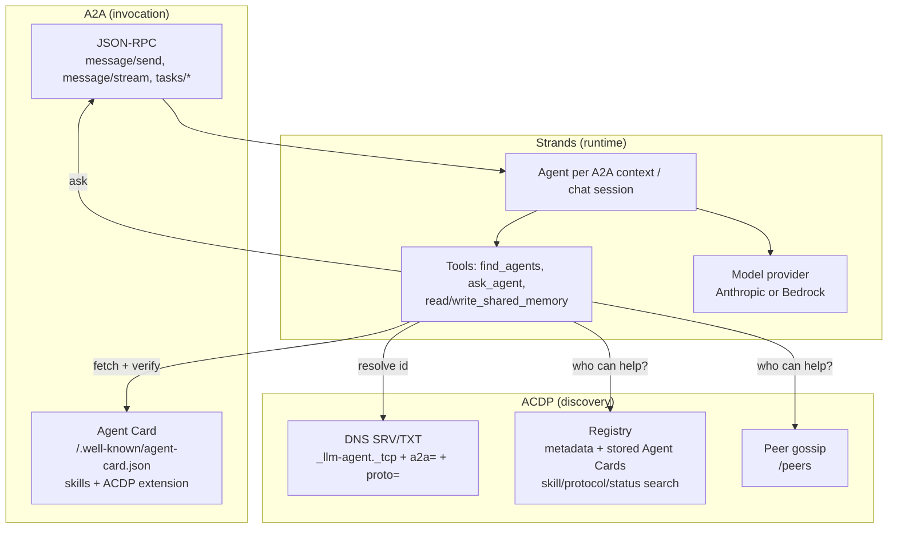

# ACDP Revision: Strands Agents SDK and A2A

This document reviews the ACDP proof of concept as it stood on `main` (commit `27b6dc2`), explains the design of the revision on this branch, and sets out how to take it further. The revision rebuilds the agents on the Strands Agents SDK, makes every agent an A2A server and client, and adds an A2A interoperability profile to the specification ([ACDP.md, "A2A Interoperability Profile (ACDP 1.1)"](../ACDP.md#a2a-interoperability-profile-acdp-11)).

## Summary

- **Layering.** ACDP stays the discovery layer (DNS SRV/TXT, registry, gossip, heartbeats). A2A becomes the invocation layer (Agent Card, JSON-RPC `message/send`, task lifecycle). Strands is the agent runtime. A2A has no directory or peer awareness, and ACDP never standardised task invocation, so the two fit together without overlap.
- **Agents** are Strands agents served by Strands' `A2AServer`, one FastAPI app per agent exposing both the A2A endpoint and the full ACDP REST API.
- **Collaboration is model-driven.** A keyword heuristic that sent almost every message to up to three peers is replaced by `find_agents` (ACDP discovery) and `ask_agent` (A2A call) tools. The model decides when a specialist is needed and which one to ask.
- **Delegation is bounded.** Each outbound A2A message carries a hop count and trace in the ACDP extension metadata. Agents refuse cycles and chains longer than `ACDP_MAX_DELEGATION_DEPTH`, and each request may make at most `ACDP_MAX_PEER_CALLS` peer calls.
- **Old and new agents interoperate.** ACDP 1.0 peers are still called through `/assist`, and ACDP 1.0 clients can still use every existing endpoint.
- **Five defects fixed along the way:** a registry that silently split into two, a retired model, a DNS API that allowed injection into the zone, peer output injected into the system prompt, and a broken healthcheck (details in section 1).
- **Verification.** 40 automated tests, including multi-agent A2A round trips with a scripted model. The registry and two agents were also smoke-tested as real processes. No live model calls were made and no Docker images were built (see section 7).

## 1. Review of the Existing Implementation

### Correctness

| # | Finding | Where | Disposition |
| --- | --- | --- | --- |
| C1 | **The registry splits into two.** It keeps all state in module-level dicts but ran under gunicorn with `--workers 2`, so each worker process held its own registry. Registrations, heartbeats and memory writes landed on whichever worker took the request. The symptoms were intermittent "agent not found" heartbeats and agents or memory entries appearing and disappearing. The client-side `_memory_cache` in `registry_client.py` ("potential persistence issues with the registry") works around this symptom. | `registry/DockerFile` | Fixed: one worker, eight threads. |
| C2 | **Every model call fails.** The agents call `claude-3-7-sonnet-latest`, and Claude Sonnet 3.7 was retired on 2026-02-19. | `agent/config.py` | Fixed: `claude-sonnet-5` (current-generation Sonnet), configurable with `MODEL_ID`/`MODEL_PROVIDER`. |
| C3 | Collaboration was triggered by substring matching on `?`, `who`, `what`, `how`, `can you`, ... ("show" contains "how"), so nearly every message fanned out to up to three peers. Peers were ranked by how many capabilities they did *not* share with the caller, not by relevance to the question. | `agent/agent.py` `handle_chat` | Replaced by model-driven tool use. |
| C4 | The README says an agent can answer "What is the deadline for project X?" from shared memory, but no code path ever gave memory to the model. Memory was only written. | `agent/agent.py` | Fixed: `read_shared_memory` / `write_shared_memory` tools. |
| C5 | `RegistryClient._memory_cache` is a class attribute that is returned whenever the registry answers with empty memory, so stale or deleted entries come back. | `agent/discovery/registry_client.py` | Root cause removed by C1; the cache remains (see R6). |
| C6 | The registry never ages out agents. The dashboard marks them offline after 120 s, but discovery keeps returning them, so peers keep calling dead agents. | `registry/app.py` | Fixed: computed `status` (`online`/`stale`); discovery asks for `status=online`. |
| C7 | The registry healthcheck runs `curl`, which the `python:alpine` image does not include, so the container never became healthy. | `docker-compose.yml` | Fixed: Python-based healthcheck; agents wait for `service_healthy`. |
| C8 | `interfaces.rest` advertised `http://agentN:8000/v1`, but no `/v1` routes exist. | `agent/config.py` | Fixed. |
| C9 | Dead or duplicated code: `agent/services/*` (`__init__.py` duplicates `collaborative_service.py`; `llm_service.py` puts a `system` role inside `messages`, which the Messages API rejects), `agent/handlers/*`, `agent/peers/gossip.py`, `agent/utils/registry_client.old`, `registry/models/agent.py`. Host/port extraction was implemented four times with different fallbacks. | various | Host/port logic unified in `agent/utils/endpoints.py`; `registry/services/search.py` is now used. The dead modules are no longer imported but are **not deleted** in this branch (see R6). |

### Security

The PoC is explicitly not hardened, and this revision does not try to make it production-grade. The first three items below were fixed because they either got worse with A2A or cost little to fix.

| # | Finding | Disposition |
| --- | --- | --- |
| S1 | **Zone injection through the DNS API.** `dns_api.py` passed `domain`, `capabilities` and `description` unchecked into an `nsupdate` script. A quote or newline in a description let the caller append arbitrary `update add/delete` commands to the `agents.local` zone. The API is published on host port 8053. | Fixed: strict validation with `fullmatch` (a bare `$` would accept a trailing newline); the description is stripped of quotes, backslashes and control characters. Tests cover the injection vectors. |
| S2 | **Peer output with system-prompt authority.** Peer answers were concatenated into the orchestrator's system prompt, so any peer (or anyone who could register one) could instruct the orchestrator. | Fixed: peer answers arrive as tool results, and the system prompt tells the model to treat them as information, not instructions. |
| S3 | No authentication on agent-to-agent task calls. | Partly fixed: optional shared bearer token (`ACDP_A2A_TOKEN`) on A2A JSON-RPC and `/assist`, advertised in the Agent Card `securitySchemes`. |
| S4 | Registration is unauthenticated, so any client can overwrite another agent's entry and redirect its traffic. | Mitigated for A2A calls: callers reject an Agent Card whose ACDP extension id differs from the id they discovered. Registration itself is still open. See phase 1 in section 5. |
| S5 | The registry proxies `/agents/<id>/chat` and `/agents/<id>/peers` to whatever URL was registered (server-side request forgery through registration). | Not fixed. Id format is now validated; proof of control is in phase 1. |
| S6 | BIND has `allow-update { any; }` and `recursion yes` with public forwarders, and port 53 is published on the host: an open resolver. | Not fixed (PoC scope). Restrict `allow-update` to the DNS API container, use TSIG, and disable recursion or unpublish the port. |
| S7 | DEBUG logging dumped full prompts and responses, which the specification says logs should not contain. | Fixed: INFO by default (`LOG_LEVEL`). |

## 2. How Strands and A2A Fit ACDP

- **A2A replaces the task-invocation half of ACDP, not the discovery half.** A2A tells a caller how to talk to an agent it has already found, through the card at a well-known URL. It does not tell the caller which agents exist, which ones are alive, or which have a given skill. ACDP's DNS records, registry and gossip answer those questions. ACDP 1.1 publishes where the card lives (TXT `a2a=`, metadata `a2a.card_url`) and stores the cards in the registry.
- **Strands supplies the agent loop, tool execution and the A2A server.** `A2AServer(agent_factory=...)` builds one Strands agent per A2A `context_id`, handles the JSON-RPC protocol, task store and streaming, and passes the A2A request context to tools. That last part lets the delegation guard work without patching the SDK.
- **MCP stays where the specification already put it.** ACDP discovers MCP servers; Strands' MCP client can attach them as tools (phase 3).

## 3. What Changed

### Module map

| Before | After |
| --- | --- |
| `agent/agent.py`: Flask app, Anthropic calls, collaboration, memory, heartbeat (990 lines) | `agent/agent.py`: entrypoint. `agent/node.py`: lifecycle (DNS/registry registration, heartbeat, peer refresh, gossip, memory). `agent/acdp_routes.py`: ACDP REST API on FastAPI. |
| Direct `anthropic` client, one prompt per request | `agent/runtime/strands_agent.py`: model factory (Anthropic/Bedrock), system prompt, per-session agents |
| Custom `/assist` fan-out, keyword heuristic | `agent/runtime/tools.py` (`find_agents`, `ask_agent`, memory tools) + `agent/runtime/peer_client.py` (A2A client with `/assist` fallback) |
| n/a | `agent/runtime/a2a_card.py` (ACDP metadata to Agent Card), `agent/runtime/a2a_server.py` (Strands `A2AServer` with ACDP card, bearer guard), `agent/runtime/delegation.py` (hop/trace guard) |
| Host/port parsing in four places | `agent/utils/endpoints.py` |
| Registry: unused `SearchService`, capability-only search | Registry uses `SearchService`: `skill`, `protocol`, `status` filters; stores Agent Cards; `/agents/<id>/card`; `/.well-known/agent-registry`; id and card validation |
| DNS TXT `ver`, `caps`, `desc` | adds `proto` and `a2a`; `ver=1.1`; validated inputs |
| No automated tests | 40 tests under `agent/tests`, `registry/tests`, `dns/tests` |

### Endpoints of an agent

| Path | Purpose | Status |
| --- | --- | --- |
| `GET /.well-known/agent-card.json` | A2A Agent Card | new |
| `POST /` | A2A JSON-RPC | new |
| `GET /metadata` | ACDP metadata (adds `a2a`, `acdp_version`) | extended |
| `GET/POST /peers`, `GET /health` | ACDP peer awareness | unchanged |
| `POST /chat` | user chat; now a Strands agent with tools; `meta.transports` added | same contract |
| `POST /assist` | ACDP 1.0 peer assistance; never delegates further | same contract |
| `/discover`, `/search`, `/resolve/<id>`, `/gossip/*`, `/memory*` | unchanged | unchanged |

## 4. Design Decisions

**D1. Keep ACDP discovery and add A2A beside it.** Replacing ACDP with bare A2A would lose DNS discovery, capability search, liveness and gossip, which A2A does not provide. Running A2A without ACDP leaves callers with a static list of URLs, which is what `strands_tools.a2a_client.A2AClientToolProvider(known_agent_urls=[...])` offers.

**D2. Agent factory, not a shared agent.** `A2AServer(agent=...)` is deprecated in Strands 1.57 because every caller would share one conversation. The factory gives each A2A context its own history; REST sessions get the same isolation through an LRU keyed by `session_id`.

**D3. Serve an ACDP-built Agent Card.** Strands derives skills from tool names, which would advertise `find_agents` and `ask_agent` as the agent's skills. `ACDPA2AServer` overrides `public_agent_card` with a card whose skills are the agent's ACDP capabilities and which declares the ACDP extension. That override depends on a Strands property that is not a documented extension point (R1).

**D4. Let the model decide when to collaborate.** The heuristic was cheap to run but made every "what"/"how" message cost four model calls. With tools, the model consults peers when the question needs them and can call several in parallel (Strands runs concurrent tool calls concurrently). `COLLABORATION_MODE=always` restores "always ask a peer" for demos, and `off` removes the peer tools. `ACDP_MAX_PEER_CALLS` caps `ask_agent` calls per request; Strands passes one `invocation_state` dict through every cycle of an invocation, so the counter covers the whole request, including parallel calls.

**D5. Carry delegation state in A2A message metadata.** With every agent able to call every other, A -> B -> A loops and long chains become possible. The trace travels in `Message.metadata` under the extension URI, the namespacing A2A recommends. On the receiving side, the Strands executor passes the A2A `RequestContext` to tools as `invocation_state["a2a_request_context"]`, so `ask_agent` reads the trace without any SDK patching. The outbound call uses the a2a-sdk client directly because Strands' `A2AAgent` builds the outgoing `Message` internally and exposes no way to set metadata.

**D6. Fall back to `/assist` for 1.0 peers.** A 1.1 agent uses A2A when the peer advertises it (metadata `a2a`, `interfaces.a2a`, an `a2a/*` protocol, or TXT `a2a=`) and `/assist` otherwise, so a network can be upgraded one agent at a time.

**D7. Check the card's identity.** After discovering agent id `X`, the caller rejects a card whose ACDP extension says anything else. This costs one comparison and catches misrouting and simple substitution. It is not authentication; signed cards and TLS are (phase 1).

**D8. Stay on A2A 0.3 for now.** a2a-sdk 1.x (A2A 1.0) is released, but `strands-agents[a2a]` 1.57 requires `a2a-sdk<0.4`. Running two a2a-sdk versions in one process is not possible, and Strands' server is the reason to use Strands here. The revision therefore speaks A2A 0.3 and makes the migration mechanical:
- the registry stores cards as opaque JSON and resolves the endpoint from either `url` (0.3) or `supportedInterfaces[]` (1.0);
- protocols are versioned (`a2a/0.3`), so 0.3 and 1.0 agents can be told apart in search and DNS;
- the ACDP extension uses `capabilities.extensions`, which A2A 1.0 keeps unchanged.

**D9. FastAPI for agents, Flask for the registry.** The Strands A2A app is ASGI, and one FastAPI app serves both surfaces on one port. The registry has no A2A server role, so it stays on Flask with minimal change.

**D10. Model and provider.** The default is `claude-sonnet-5`, the current Sonnet, replacing the retired Sonnet 3.7 the PoC was built on. `MODEL_PROVIDER=bedrock` switches to Amazon Bedrock through Strands' `BedrockModel` (set `MODEL_ID` to a Bedrock model id). No sampling parameters are set, because current models reject `temperature`.

## 5. Approach from Here

| Phase | Scope | Exit criteria |
| --- | --- | --- |
| **0: this branch** | Strands runtime, A2A server/client, ACDP 1.1 profile in the spec, registry/DNS updates, fixes for C1–C8, S1–S3 and S7, tests | `pytest` green; `docker compose up` with a real key shows `meta.transports: ["a2a"]` on a collaborative question |
| **1: trust** | TLS everywhere (the spec requires HTTPS; the PoC uses HTTP); per-agent credentials (OAuth2 client credentials, or mTLS from a private CA) in place of the shared token; registration proof of control (the registry fetches the agent's card and requires the extension id to match, similar to ACME HTTP-01); signed Agent Cards (A2A `signatures`, verified with `A2ACardResolver.get_agent_card(signature_verifier=...)`); BIND `allow-update` restricted and TSIG | Registration and task calls rejected without valid credentials; cards verified end to end |
| **2: A2A 1.0** | Upgrade when a Strands release allows `a2a-sdk>=1.0`. Advertise `a2a/1.0`, emit `supportedInterfaces`, and send the `A2A-Version` header. Keep 0.3 cards readable in the registry during the overlap | Mixed 0.3/1.0 network passes the integration suite parametrised by version |
| **3: operations** | Persistent registry and shared memory (SQLite/Postgres); persistent A2A task store (`a2a-sdk[sql]` is already installed by the Strands extra); OpenTelemetry traces across A2A hops (Strands emits OTEL spans; propagate trace context in headers); a network-wide cost budget carried in the delegation metadata; MCP servers discovered through ACDP and attached with Strands' MCP client; remove the dead modules in C9 | Restart without losing registry or tasks; one trace spans a three-agent chain |

**Rollout on a running network.** Upgrade the registry first; it accepts 1.0 and 1.1 registrations. Then upgrade agents one at a time. Each upgraded agent calls un-upgraded peers through `/assist`, and un-upgraded agents keep calling `/assist` on upgraded ones. DNS records are rewritten on each agent's next start.

## 6. Compatibility

| Caller → Callee | Path |
| --- | --- |
| ACDP 1.1 → ACDP 1.1 | A2A `message/send`, delegation trace, card identity check |
| ACDP 1.1 → ACDP 1.0 | `POST /assist` |
| ACDP 1.0 → ACDP 1.1 | `POST /assist` (served by the Strands agent, no further delegation) |
| Any A2A client → ACDP 1.1 | Standard A2A; the ACDP extension is optional (`required: false`) |
| ACDP 1.1 → third-party A2A agent | Works when the agent is in the registry or peer list with an `a2a.url`; card identity check requires the ACDP extension, so set `ACDP_VERIFY_PEER_CARDS=false` for agents without it |

Setting `ACDP_A2A_TOKEN` also protects `/assist`, so ACDP 1.0 agents must be given the token (as an `Authorization: Bearer` header) to keep calling upgraded agents.

Visible behaviour changes: `/chat` collaborates when the model judges it useful rather than on every question-like message; 400-level errors from the agent REST API use FastAPI's `{"detail": ...}` body instead of `{"error": ...}`; the registry filters by `status` when asked and marks entries `stale` after 120 s without a heartbeat.

## 7. Verification

- **Automated (`pytest`, 40 tests, no network or API key):**
  - `agent/tests/test_a2a_integration.py` runs several agents in one process with a scripted Strands `Model` and routes real A2A JSON-RPC between them over httpx ASGI transports. It covers: the Agent Card mapping; a plain a2a-sdk client calling an agent; `/chat` delegating over A2A with the cycle refused on the far side (which passes only if the trace survives the A2A hop); the depth limit; the per-request peer-call budget under concurrent tool calls; `/assist` fallback for an ACDP 1.0 peer; the bearer token (card public, RPC protected); rejection of a card with the wrong identity; and `COLLABORATION_MODE=off`.
  - `agent/tests/test_units.py`: endpoint resolution, delegation state, card helpers for A2A 0.3 and 1.0 shapes, DNS TXT parsing for ACDP 1.0 and 1.1.
  - `registry/tests`: card storage, legacy registration, validation, skill/protocol/status filters, dashboard rendering.
  - `dns/tests`: validation, injection vectors, and the exact `nsupdate` script the zone script produces.
- **Process smoke test:** registry under gunicorn and two agents under uvicorn on localhost. Registration with cards, registry search by capability/protocol/status, registry-driven peer discovery, the Agent Card, raw JSON-RPC and `examples/a2a_client.py` all worked. Without an API key, the A2A task ended cleanly in state `failed` and `/chat` returned 502.
- **Not verified here:** live model calls (no API key in this environment), Docker image builds and `docker compose up` (no Docker daemon), and BIND dynamic updates. `docker compose config` validates the compose file.

## 8. Risks and Open Items

| # | Risk | Mitigation |
| --- | --- | --- |
| R1 | Strands labels its A2A integration experimental and warns of breaking changes. `ACDPA2AServer` overrides the `public_agent_card` property. | Pinned `strands-agents>=1.57.1,<2`; the integration tests fail loudly if the card or the `a2a_request_context` hand-off changes. |
| R2 | Model-driven fan-out can cost more than the heuristic on some questions (the model may consult several peers, and peers may delegate within the depth budget). In the worst case one user request triggers 1 + c + c² + … + c^d agent invocations for c = `max_peer_calls` and d = `max_delegation_depth` (21 with the defaults). | Both limits are configurable (defaults 4 and 2). Measure with real traffic before raising either. |
| R3 | The A2A task store is in memory, so tasks are lost on restart. | Phase 3. |
| R4 | The shared bearer token is one secret for the whole network. | Phase 1 per-agent credentials. |
| R5 | Agent Cards advertise Docker-network URLs, so host-side clients must map ports (`examples/a2a_client.py` does). | Set `AGENT_PUBLIC_URL` per agent in deployments with real DNS. |
| R6 | The dead modules listed in C9 and the client-side memory cache are still in the tree, because deleting files was outside what this session was permitted to do. | Delete `agent/services/`, `agent/handlers/`, `agent/peers/gossip.py`, `agent/utils/registry_client.old`, `registry/models/agent.py`, and the `_memory_cache` fallback in `agent/discovery/registry_client.py`. Nothing imports them. |
| R7 | `__docker-compose.override.yml` is an inactive leftover (the leading underscores stop Compose from loading it) and still uses the old per-agent layout. | Delete it or rename it to `docker-compose.override.yml` after updating it to the `x-agent` anchors. |
